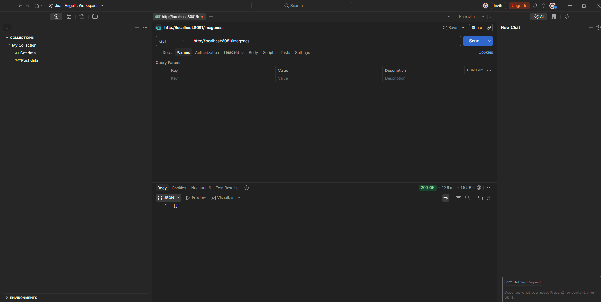
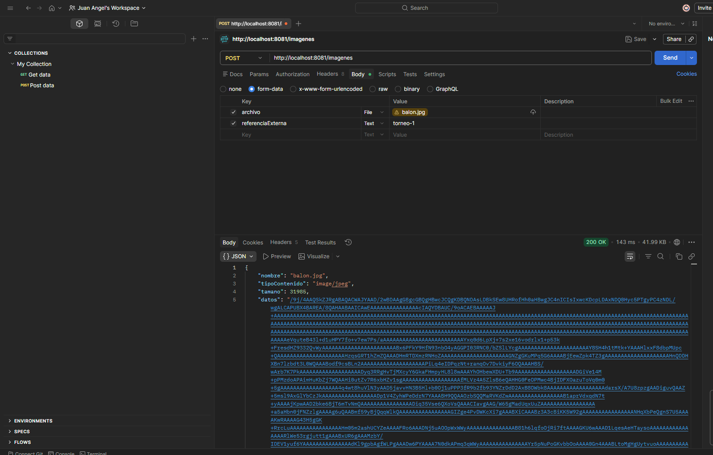
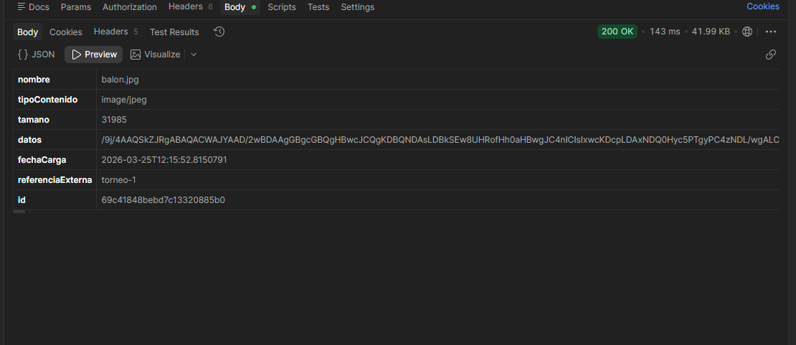
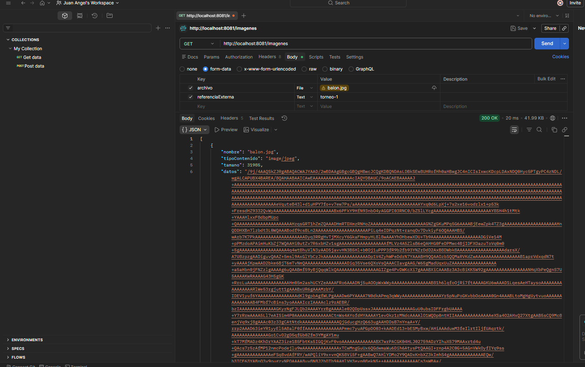
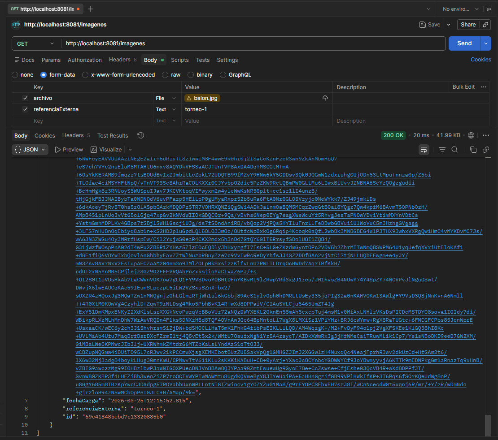
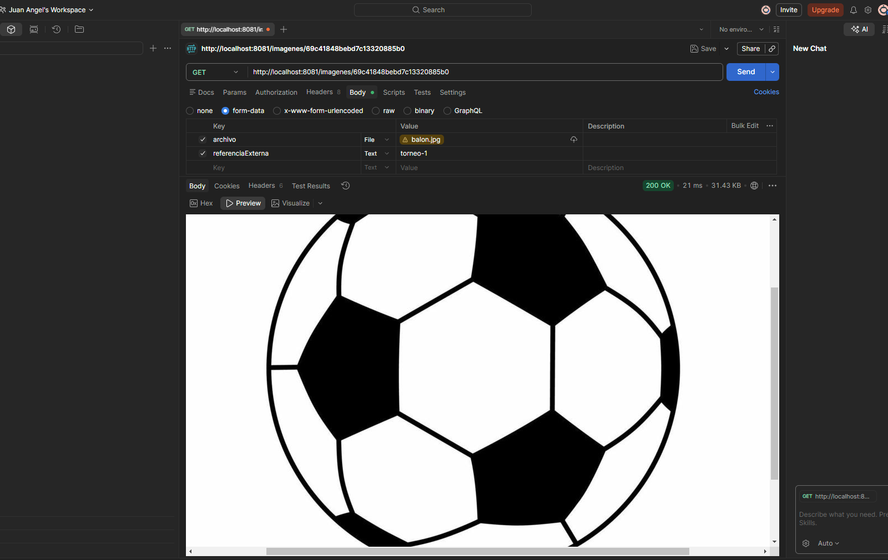
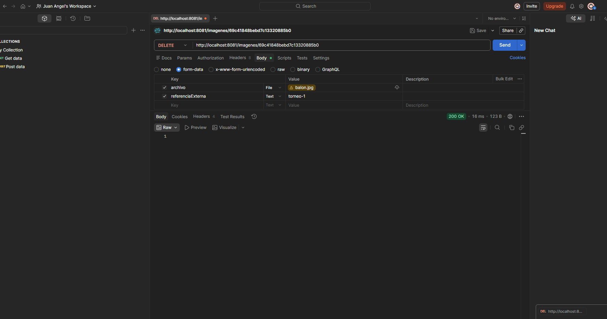
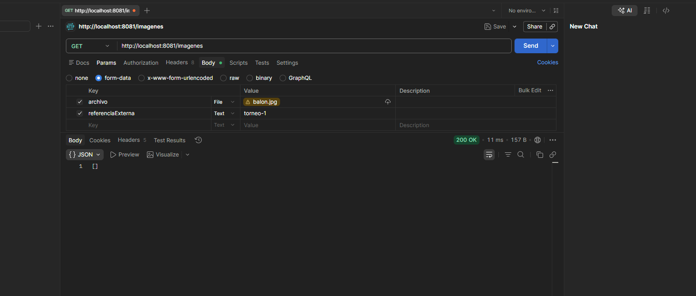
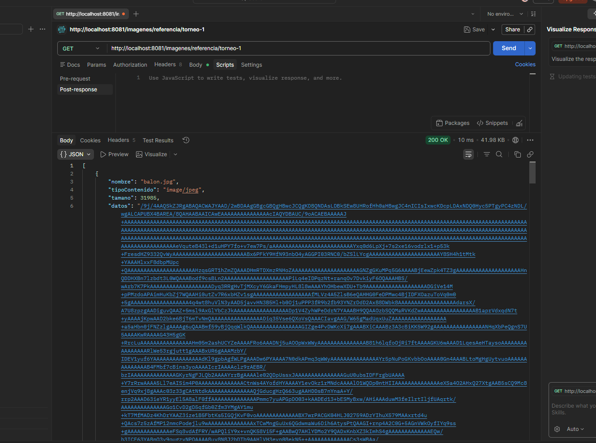
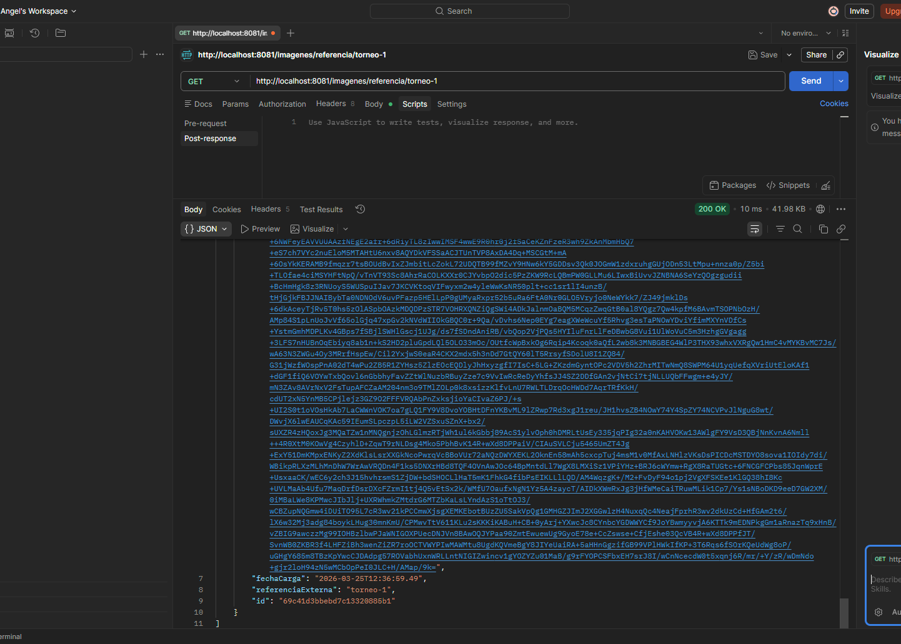

PRUEBAS MICROSERVICIO

0. Obtener una Imagen:
    

1. Subir una Imagen:
    
    

2. Listar Imagenes:
    
    

3. Consultar una imagen por id:
    id = 69c41848bebd7c13320885b0
    

4. Eliminar una Imagen:
    
    

    luego Se confirma si se elimino la Imagen:
    
5. Listar imágenes por referencia externa:
    
    